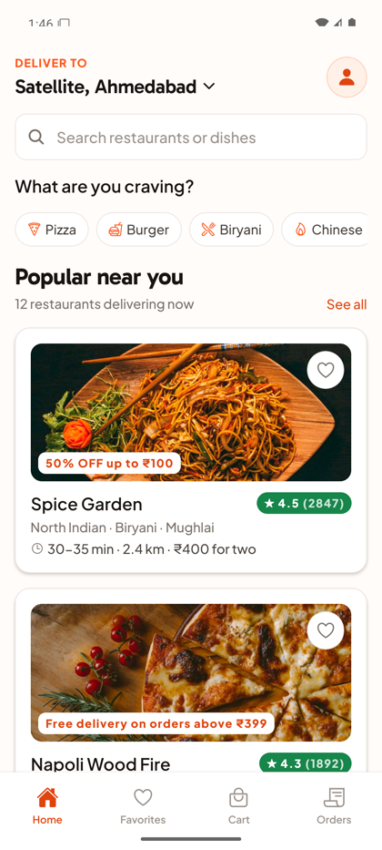
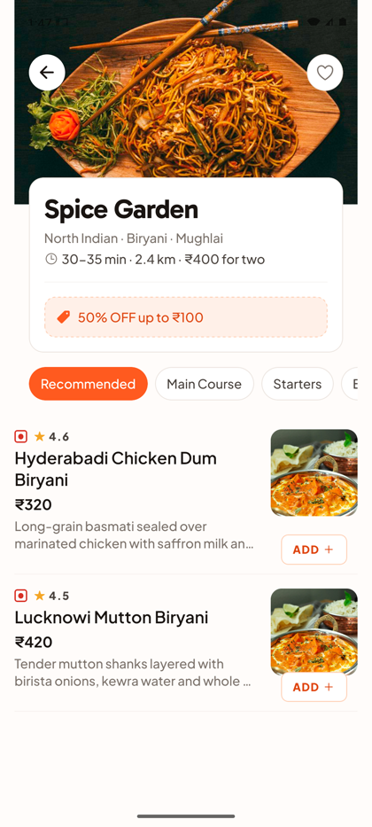
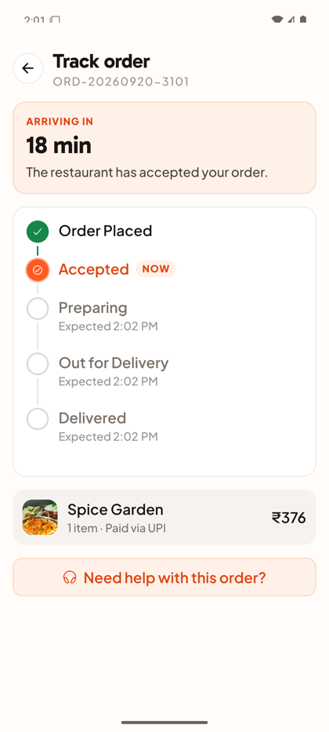
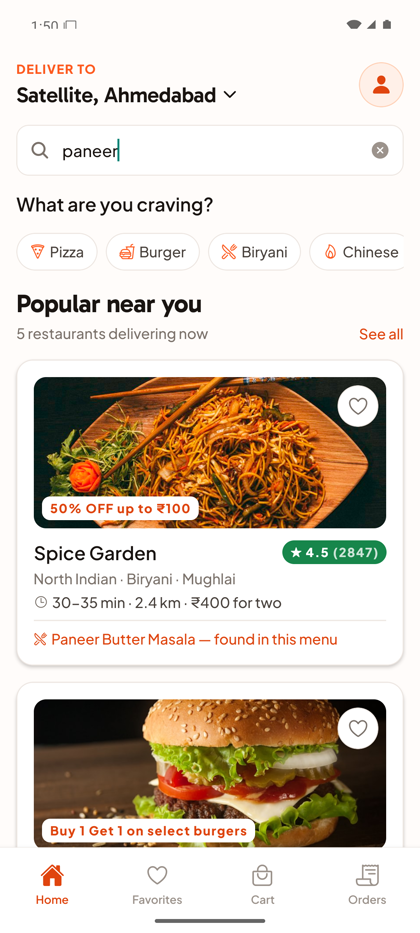
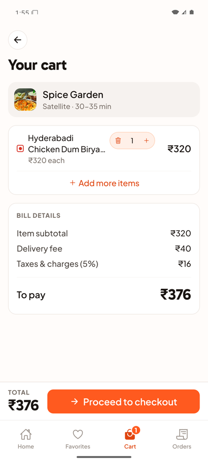
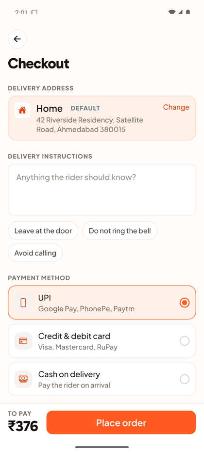
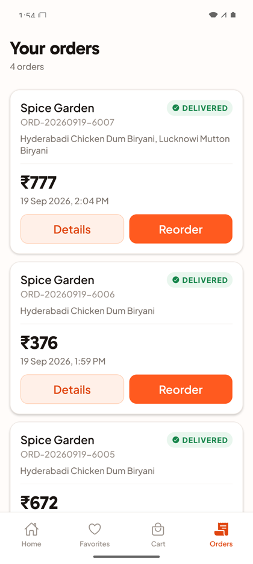
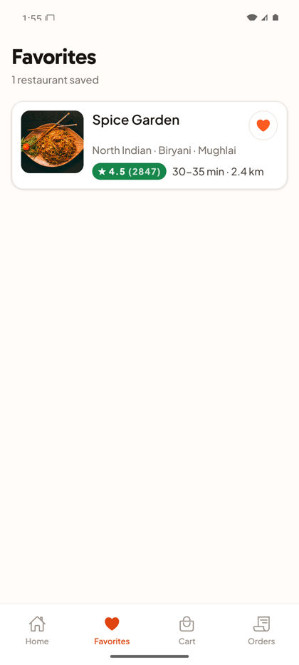
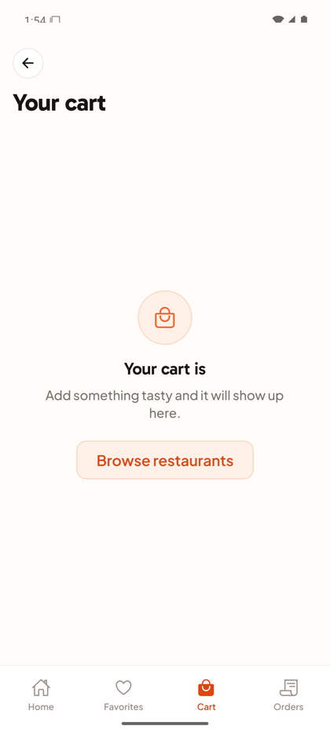

<div align="center">

# 🍔 Mini Food Delivery App

**A React Native food delivery app — browse restaurants, build a cart, check out, and watch your order move through five live delivery stages.**

No backend. All data is local mock data, and the order status is simulated on the device.





</div>

---

## Quick start

```bash
git clone https://github.com/ankitakachhad/food-delivery-app.git
cd food-delivery-app
npm install
npx react-native-asset          # links the bundled fonts into iOS and Android
```

**Android**

```bash
npm run android
```

**iOS** (macOS only)

```bash
bundle install                                    # once
bundle exec pod install --project-directory=ios
npm run ios
```

If Metro is not already running, start it in a separate terminal with `npm start`.

<details>
<summary><b>What you need installed</b></summary>

<br>

| | Version |
|---|---|
| Node | 22.11 or newer |
| JDK | 17 (Android) |
| Android Studio | with SDK 36 + build-tools 36 |
| Xcode + CocoaPods | iOS only |

This is a **bare React Native CLI** project — there is no Expo, so an emulator or a real
device is required.

</details>

---

## Screenshots

| Home | Search | Restaurant details |
|:---:|:---:|:---:|
|  |  |  |
| Search bar, categories, restaurant cards | Matches **dishes too** — not just restaurant names | Menu with category tabs and add-to-cart |

| Cart | Checkout | Order tracking |
|:---:|:---:|:---:|
|  |  |  |
| Quantity, subtotal, delivery fee, tax, total | Address, instructions, payment method | Five stages, advancing live |

| Order history | Favorites | Empty state |
|:---:|:---:|:---:|
|  |  |  |
| Id, restaurant, total, date, status | Saved restaurants, persisted | Loading, empty and error states handled everywhere |

---

## Features

**Screens**

- **Home** — search bar, food categories, restaurant list with image, name, rating, cuisine and delivery time
- **Restaurant details** — restaurant info, menu grouped by category, add to cart, increase/decrease quantity
- **Cart** — line items, quantity changes, remove, subtotal / delivery fee / tax / total, proceed to checkout
- **Checkout** — delivery address, delivery instructions, payment method, order summary, place order
- **Order tracking** — Order Placed → Accepted → Preparing → Out for Delivery → Delivered, simulated locally
- **Order history** — past orders with id, restaurant, total, date, status, and full details

**Also included**

- Search across restaurants **and** dishes — a dish match tells you which menu it was found in
- Add and remove favourites
- Cart, favourites and orders persisted locally, so they survive an app restart
- Loading, empty and error states on every list screen
- Reusable components in `src/components/common/`
- Layered, scalable folder structure
- Works across screen sizes — responsive scaling, no fixed widths, text truncates rather than overflows

**Bonus**

- 🌙 **Dark mode** — system, light or dark, chosen in Settings and persisted
- ✨ **Animations** — pulsing ring on the active tracking step, animated favourite button, list entrance transitions
- ⚡ **Optimised lists** — `React.memo`, `useCallback` renderers, tuned `FlatList` batching, pagination on scroll
- 📡 **Offline handling** — banner at the top of every screen, and checkout blocked while offline

---

## Libraries used

| Package | Why |
| --- | --- |
| `react-native` 0.86 | Bare React Native CLI project, with the generated `ios/` and `android/` projects checked in |
| `@reduxjs/toolkit`, `react-redux` | App state in small, separate slices; `createSelector` keeps derived values memoised |
| `redux-persist` + `@react-native-async-storage/async-storage` | Persists cart, favourites, orders and theme across app restarts |
| `@react-navigation/native`, `native-stack`, `bottom-tabs` | Four-tab shell with a stack on top for detail screens |
| `react-native-reanimated` | The pulsing ring on the active order-tracking step, and list entrance animations |
| `react-native-worklets` | Reanimated 4 needs this as a direct dependency — it supplies the worklet runtime and the Babel plugin in `babel.config.js` |
| `@react-native-community/netinfo` | Offline detection for the banner and the disabled checkout button |
| `react-native-vector-icons` | Ionicons throughout |
| `react-native-asset` | Links the `.ttf` files in `assets/fonts` into both native projects — Gabarito for headings, Plus Jakarta Sans for body |

---

## Architecture

All application code lives under `src/`, organised **by layer, not by screen**, so a new
feature means a new slice and a new screen without touching anything else. `ios/` and
`android/` are the generated native projects and are checked in, as in any bare RN app.

```
src/
├── navigation/     RootNavigator (stack), BottomTabs, route name constants
├── screens/        One file per screen
├── components/
│   ├── common/     Reusable across the whole app (AppText, AppButton, QuantityStepper, …)
│   ├── home/       Home-specific pieces
│   ├── restaurant/ Restaurant card, details header, view-cart bar
│   ├── menu/       Menu rows and category tabs
│   ├── cart/       Cart rows, price breakdown, summary bar
│   ├── checkout/   Address form, payment selector, summary bar
│   └── order/      Status timeline, order history card
├── store/          Redux store + five slices
├── data/           Mock JSON and the fake API layer
├── utils/          Pure functions — pricing, formatting, search, id generation
├── hooks/          useTheme, useDebounce, usePagination, useNetworkStatus, useOrderSimulation
├── theme/          Colour palettes, spacing, radius, typography, responsive scaling
└── constants/      Config values and the order status list
```

Two rules keep this consistent:

- **No hard-coded colours or spacing.** Everything comes from `src/theme/`. The light and
  dark palettes share identical keys, so no component ever branches on the active theme.
- **Business logic lives outside components.** Every price calculation is a pure function in
  `src/utils/pricing.js`, which makes it easy to read and to test.

---

## State management

Five slices, each owning one concern:

| Slice | Holds |
| --- | --- |
| `cartSlice` | Current restaurant, line items, and memoised total selectors |
| `favoritesSlice` | Saved restaurant ids |
| `ordersSlice` | Placed orders and their progress through the five statuses |
| `restaurantsSlice` | Fetched restaurants plus `idle / loading / succeeded / failed` status |
| `themeSlice` | `system` / `light` / `dark` preference |

`redux-persist` writes `cart`, `favorites`, `orders` and `theme` to AsyncStorage.
`restaurants` is deliberately **excluded** — it is mock data that should be re-fetched on
every launch, and persisting it would hide the loading and error states.

---

## Design decisions worth calling out

**The fake API fails on purpose.** `src/data/mockApi.js` resolves after ~800 ms and rejects
roughly 15% of the time. Without a backend there is no other way to genuinely exercise the
loading skeletons and the error-with-retry state, so the failure is built in. Reload the app
a few times to see it.

**The cart holds one restaurant at a time.** Adding an item from a different restaurant is
rejected by the reducer; the UI catches this and offers to replace the cart instead. This
mirrors how real delivery apps work, and keeps the delivery fee and restaurant strip coherent.

**Order status survives the app being closed.** A timer advances the status while the tracking
screen is open, but `syncStatusesByTime()` also recomputes every order's status from the time
elapsed since it was placed. Without this, closing the app would freeze an order at
"Preparing" forever.

**Prices are rounded once, in one place.** `calcTax` rounds to whole rupees so the displayed
lines always add up to the displayed total.

---

## Known limitations

- Addresses and payment methods are UI only; nothing is validated against a real service.
- Restaurant photos are remote URLs, so the first load of each image needs a connection.
  Caching is whatever the platform image loader does by default; there is no explicit
  offline image cache.
